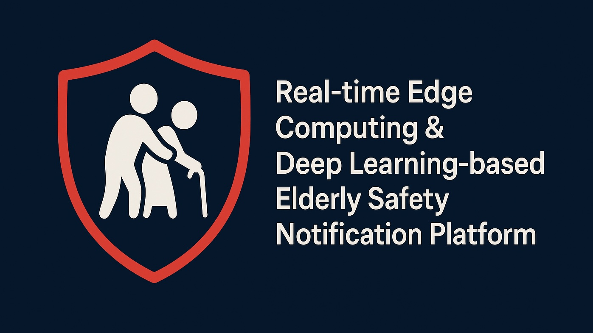
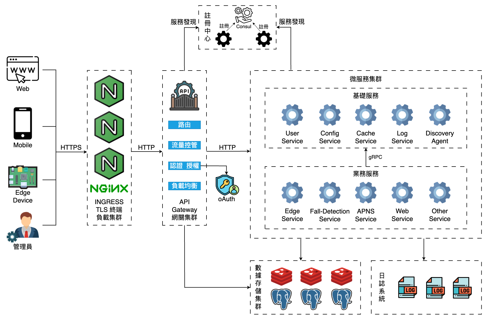

# RED-Safe




🔗 **[前往 RedSafe 官方網站](https://www.redsafe-tw.com/)**

---

**基於邊緣運算與深度學習的老人安全即時通報平台**

---

## 目錄

1. [專案簡介](#專案簡介)  
2. [核心功能](#核心功能)  
3. [系統架構](#系統架構) 
4. [前端開發流程](#前端開發流程)

---

## 專案簡介
**RED-Safe**是一個將 **邊緣運算** 與 **深度學習模型** 結合的老人安全監測系統。  
- 在攝影機端與邊緣伺服器上即時偵測跌倒、長時間靜止等異常行為  
- 第一時間推播安全警示至 iOS App，並可擴充手錶心率監測  
- 降低隱私影響，減少網路延遲，確保緊急通報可靠性  

---

## 核心功能

- **實時偵測**：低於 50 ms 推論延遲，快速辨識老人跌倒／長時間靜止  
- **多樣安全事件**：支援跌倒、靜止、心率異常等通報  
- **推播通知**：結合 Apple Push Notification Service (APNs)，即刻警示  
- **邊緣部署**：ONNX Runtime／TensorRT 
- **可擴充性**：易於新增多鏡頭、環境感測或穿戴式心率資料來源  

---

## 系統架構



---

## 前端開發流程

Edge Web 控制台已升級為 **Vue 3 + TypeScript + Vite** 的單頁應用。原本的 Django template 只負責載入
預編譯 bundle 與注入初始資料，所有互動邏輯皆集中在 `edge_web/frontend`。

```bash
cd edge_web/frontend
npm install              # 或使用 pnpm / yarn
npm run dev              # 啟動 Vite 開發伺服器
```

- 產出 (`npm run build`) 會寫入 `edge_web/static/frontend` 並自動產出 `manifest.json`
- Django 使用 `` 標籤讀取 manifest；開發環境亦可透過 `VITE_DEV_SERVER`
  指向埠號 5173 的 Vite dev server
- 品質檢查：`npm run lint`、`npm run lint:style`、`npm run typecheck`、`npm run test:unit`、`npm run test:e2e`
- Husky + lint-staged + commitlint 已配置，`npm run prepare` 後啟用 Git hooks

---

## Edge Web 啟動指南

### 基本需求
- Python 3.11（建議使用虛擬環境）
- Node.js 18 以上版本（對應 Vite 開發伺服器）
- PostgreSQL（預設帳號、密碼、資料庫皆為 `redsafedb`，位於 `127.0.0.1:5432`，設定位於 `edge_web/raspberry_contral/settings.py`）

### 後端（Django）
```bash
cd edge_web
python -m venv .venv
source .venv/bin/activate        # Windows 可使用 .venv\Scripts\activate
pip install -r requirements.txt
python manage.py migrate
python manage.py runserver 0.0.0.0:8000
```

若本機沒有 PostgreSQL，可透過 Docker 快速啟動：
```bash
docker run --name edge-postgres \
  -e POSTGRES_USER=redsafedb \
  -e POSTGRES_PASSWORD=redsafedb \
  -e POSTGRES_DB=redsafedb \
  -p 5432:5432 -d postgres:15
```

### 前端（Vite Dev Server）
```bash
cd edge_web/frontend
npm install                      # 或使用 pnpm、yarn
npm run dev
```

Django 若要使用開發版資產，可以設定環境變數：
```bash
export VITE_DEV_SERVER=http://localhost:5173
```

### 發佈版靜態資源
```bash
cd edge_web/frontend
npm run build
```

編譯後的檔案會輸出至 `edge_web/static/frontend`，並在 `edge_web` 目錄執行：
```bash
python manage.py collectstatic
```

### Docker 佈署
```bash
docker build -t edge-web edge_web
docker run --rm -p 8000:80 edge-web
```
執行容器時需確保 Django 能連上對應的 PostgreSQL 服務。
