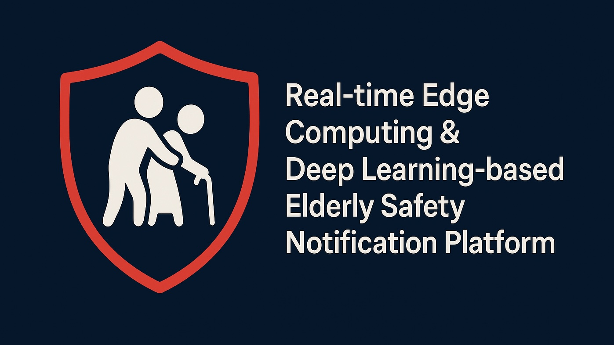

# RED-Safe




🔗 **[前往 RedSafe 官方網站](https://www.redsafe-tw.com/)**

---

**基於邊緣運算與深度學習的老人安全即時通報平台**

---

## 目錄

1. [專案簡介](#專案簡介)  
2. [核心功能](#核心功能)  
3. [系統架構](#系統架構)  
4. [Clone](#Clone)
5. [Build in unix](#build-in-unix)
6. [Build in windows](#build-in-windows)

---

## 專案簡介
**RED-Safe**是一個將 **邊緣運算** 與 **深度學習模型** 結合的老人安全監測系統。  
- 在攝影機端與邊緣伺服器上即時偵測跌倒、長時間靜止等異常行為  
- 第一時間推播安全警示至 iOS App，並可擴充手錶心率監測  
- 降低隱私影響，減少網路延遲，確保緊急通報可靠性  

---

## 核心功能

- **實時偵測**：低於 50 ms 推論延遲，快速辨識老人跌倒／長時間靜止  
- **多樣安全事件**：支援跌倒、靜止、心率異常等通報  
- **推播通知**：結合 Apple Push Notification Service (APNs)，即刻警示  
- **邊緣部署**：ONNX Runtime／TensorRT 
- **可擴充性**：易於新增多鏡頭、環境感測或穿戴式心率資料來源  

---

## 系統架構


---

## Clone

```bash
git clone https://github.com/MengXi47/RED-Safe.git
cd RED-Safe
```

## Build in unix

```bash
mkdir build
cd build
cmake ..
cmake --build .
```

## Build in windows

```bash
mkdir build
cd build
cmake -G "Visual Studio 17 2022" -A x64 -DCMAKE_BUILD_TYPE=Release -DCMAKE_TOOLCHAIN_FILE=C:/vcpkg/scripts/buildsystems/vcpkg.cmake -DVCPKG_TARGET_TRIPLET=x64-windows ..
cmake --build .
```