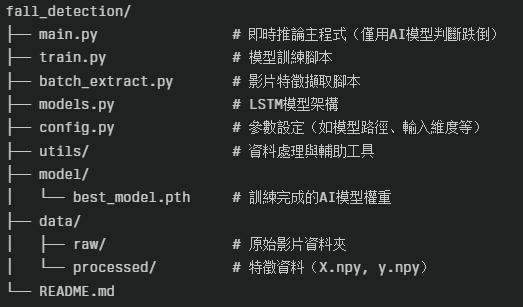

# 專案簡介
本專案是一套基於 Python、MediaPipe 與 PyTorch 開發的跌倒偵測人工智慧系統。
系統能即時從攝影機畫面擷取人體骨架特徵，並利用自訓練的 AI 模型（LSTM）判斷是否發生跌倒事件。

# 本專案設計重點：

主流程簡潔：main.py 僅負責用訓練好的 AI 模型進行跌倒判斷，不做其他複雜流程。

模組化：資料處理、模型訓練、即時推論各自獨立，便於維護與擴充。

可多攝像頭、可 GPU 加速。

# 目錄結構



# 安裝需求
Python 3.8+

torch

mediapipe

opencv-python

numpy

安裝指令：

```bash
pip install requirements.txt
```

# 使用說明
1. 資料準備與特徵擷取

   將跌倒與正常影片放入 data/raw/fall、data/raw/normal
   執行特徵擷取：
```bash
python batch_extract.py
```
2. 模型訓練

   訓練完成後會在 model/ 產生 best_model.pth。
   同時可以將原先放在 data/raw/fall、data/raw/normal 中的影片刪除。
```bash
python train.py
```

3. 日常訓練
   
   將影片放入 data/raw/fall、data/raw/normal
   執行自動腳本
```bash
python auto_run.py
```
4. 即時推論（跌倒偵測）

   系統會自動啟動攝影機，擷取骨架與角度特徵，集滿一段序列即送入 AI 模型判斷。
   螢幕上會即時顯示「Detecting...」或「Danger!」等狀態。
```bash
python main.py
```
   
# 參數調整
可於 config.py 設定模型路徑、輸入維度、序列長度等參數。
ANGLE_PAIRS 可自訂用於角度特徵的關節組合。

# 注意事項
請確保 model/best_model.pth 已由 train.py 正確產生。
若需多攝像頭支援，請於 main.py 中調整攝像頭索引。
若有特殊硬體需求（如 GPU），系統會自動偵測並使用。
